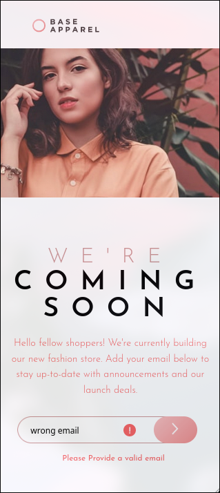

## Table of contents

- [Overview](#overview)
  - [The challenge](#the-challenge)
  - [Screenshot](#screenshot)
  - [Links](#links)
- [My process](#my-process)
  - [Built with](#built-with)
  - [What I learned](#what-i-learned)
  - [Continued development](#continued-development)
  - [Useful resources](#useful-resources)
- [Author](#author)
- [Acknowledgments](#acknowledgments)

## Overview

### The challenge

Users should be able to:

- View the optimal layout for the site depending on their device's screen size
- See hover states for all interactive elements on the page
- Receive an error message when the `form` is submitted if:
  - The `input` field is empty
  - The email address is not formatted correctly

### Screenshot

### Links

- Solution URL: [Solution URL](https://github.com/mccartheney/Base-Apparel-coming-soon-page)
- Live Site URL: [Site URL](https://cerulean-brigadeiros-5b7e48.netlify.app/)

## My process

### Built with

- HTML5
- CSS
- Flexbox

## Author

- linkedIn - [Mccartheney Mendes](https://www.linkedin.com/in/mccartheney-mendes-892709292/)
- github - [Mccartheney Mendes](https://github.com/mccartheney)
- Frontend Mentor - [@mccartheney](https://www.frontendmentor.io/profile/mccartheney)